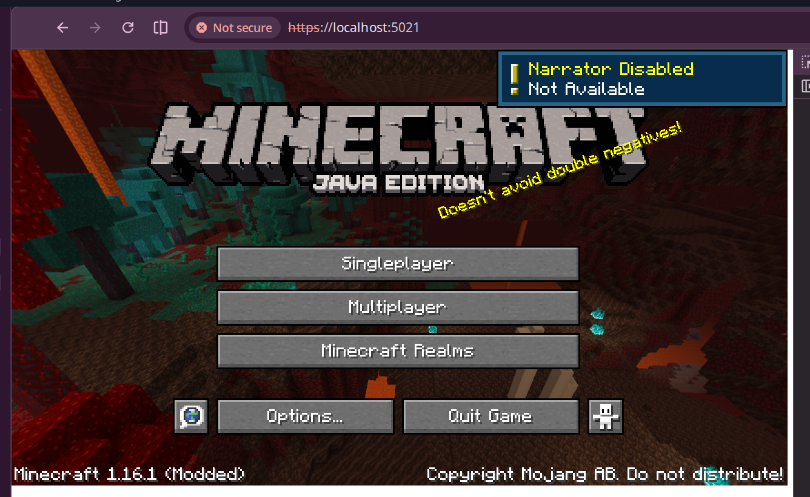

# ikvmcraft

python3 gen-static-libs.py /ikvm/bin/libiava.so:out/native/libiava.a /ikvm/bin/libzip.so:out/native/libzip.a /ikvm/bin/libnio.so:out/native/libnio.a /ikvm/bin/libnet.so:out/native/libnet.a /ikvm/bin/libmanagement.so:out/native/libmanagement.a /tmp/lwjgl/liblwjgl.so:../native-deps/out/mt/liblwjgl3.a /tmp/lwjgl/libglfw.so:../native-deps/out/mt/libglfw3.a /tmp/lwjgl/liblwjgl_stb.so:../native-deps/out/mt/liblwjgl_stb.a /tmp/lwjgl/libopenal.so:../native-deps/out/mt/liblwjgl_openal_stubs.a --symbol-list /tmp/lwjgl/libopenal.so:../native-deps/openal-symbols.txt --rename-symbol /tmp/lwjgl/libglfw.so:emscripten_glfw3_get_proc_address:glfwGetProcAddress --add-alias /tmp/lwjgl/libglfw.so:glfw3 --add-alias /tmp/lwjgl/libglfw.so:/tmp/lwjgl/liblwjgl_opengl.so --add-alias /tmp/lwjgl/libglfw.so:/tmp/lwjgl/libGL.so.1 --add-alias /tmp/lwjgl/liblwjgl.so:/tmp/lwjgl/liblwjgl_tinyfd.so > ../../../ikvm-wasm/loader/statics.c
